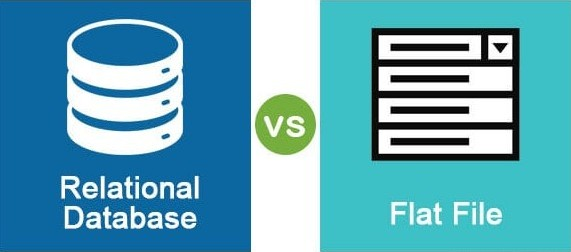

## Database Course Documentation

#### 1.Comparison Assignment: Flat File Systems vs. Relational Databases.

Flat file systems and relational databases both serves the purpose of storing information, but they do so in very different ways.
##### Structure:
  Flat file systems resemble spreadsheets, where data is stored in a single table made up of rows and columns. Each row represents a record, and each column holds specific data fields like name, address, or phone number.
  In contrast, relational databases use multiple interconnected tables. Each table focuses on a specific type of data, example: customers, products, orders, they are linked using unique identifiers such as customer ID or product ID. This design supports better organization and scalability.

##### Data Redundancy:
  Flat files often duplicate data across rows since they store all information in one place without referencing. This leads to data repetition and potential inconsistencies. 
  On the other hand, relational databases minimize redundancy by separating data into related tables and referencing shared values. This ensures data is stored efficiently and remains consistent across the system.

##### Relationships:
  Flat files lack built-in support for relationships between data entries, making it difficult to cross-reference or combine related data. Relational databases are designed to handle relationships between tables using keys.
  For example using foreign keys, an order can link to a customer and a product through their respective IDs, allowing for complex queries across datasets.

##### Example Usage:
  Flat file systems are suitable for smaller applications like contact lists or simple inventory records in a small store. Their simplicity makes them easy to use without much technical knowledge.
  In contrast, relational databases are ideal for large scale or expanding businesses such as LBM (Lumber and Building Materials) dealers with multiple branches. These databases allow centralized storage of customer, order, and product data, which can be efficiently queried and compared across locations.

##### Drawbacks:
  Flat file systems and relational databases both have drawbacks, especially when dealing with large or complex datasets. Flat file systems can become difficult to manage once you have more than a few thousand records.
  They are harder to update, may contain non-unique records, have a higher risk of data duplication, and often become inefficient over time. Additionally, they struggle with maintaining consistency, leading to data redundancy and potential errors.
  On the other hand, relational databases, while more powerful and efficient, come with their own challenges. They are more complex to design and manage, requiring technical expertise to set up relationships and ensure data integrity. They may also require specialized software and resources, which can be a limitation for small-scale or temporary data storage needs.

#### 2. DBMS Advantages

#### 3. Roles in a Database System
A **Database Administrator (DBA)** manages and maintains database systems to ensure data security, performance, and compliance. DBAs work across various industries like tech, finance, and education, handling tasks such as:
- Installing, configuring, and monitoring databases.

- Enforcing standards, policies, and security measures.

- Supporting database design and testing.

- Performing backups, tuning, and updates.

- Monitoring usage, performance, and concurrency.

A **Systems Analyst** evaluates an organization’s existing IT systems and designs improvements to meet business objectives. They gather requirements from stakeholders,
analyze system needs, and create detailed specifications including data models and workflows. They guide system design and implementation, ensuring new systems are efficient and meet user needs.

A **Database Designer** defines the structure and organization of data. They identify entities, relationships, and attributes, crafting conceptual, logical, and physical data models. They determine normalization,
indexing, partitioning, and schemas to optimize storage and performance. 

A **Database Developer** builds and maintains the database infrastructure. They write SQL, develop stored procedures, design ETL processes, and optimize performance. They collaborate with BI teams to support analytics and ensure the database meets application and reporting needs.

An **Application Developer** creates software applications that interact with the database. While not always a database expert, they integrate front-end or back-end code to query and manipulate data. Their work closely ties to database functionality, especially in smaller teams.

A **BI Developer** designs and implements data solutions to support business analytics. They build ETL pipelines, data models, dashboards, and reports using BI tools. They transform raw data into insightful information, ensuring security and compliance in BI systems.

#### 4. Types of Databases
##### Relational vs. Non‑Relational Databases
**Relational Databases** use structured, table-based formats with predefined schemas and rely on SQL (Structured Query Language) to manage and manipulate data. These databases ensure data integrity through strong ACID (Atomicity, Consistency, Isolation, Durability) compliance, making them ideal for systems that require reliable transactions—such as banking systems, CRM platforms, and inventory management tools. Popular examples include MySQL, PostgreSQL, Oracle, and Microsoft SQL Server.
Relational databases are best used in scenarios that demand structured data storage, reliable transactions, and complex querying. Industries like finance, healthcare, and enterprise resource planning (ERP) systems benefit greatly from relational database systems due to their stability and consistency.

**Non‑Relational Databases** are designed to store and manage unstructured or semi-structured data. They do not require fixed schemas and can use various models like document (MongoDB), wide-column (Cassandra), key-value (Redis), or graph (Neo4j). These databases offer scalability, flexibility, and high-speed performance, making them well-suited for social media platforms, real-time analytics, IoT applications, and content management systems.
Non-relational databases are ideal for applications that manage large volumes of dynamic or unstructured data. Use cases include social media platforms, real-time recommendation engines, big data analytics, content management systems, and IoT data processing.

#### Centralized vs. Distributed vs. Cloud Databases
**Centralized Databases** are hosted and managed in a single physical location. This setup simplifies design, maintenance, and control, and ensures a single point of truth. However, it also presents a single point of failure if the system goes down due to hardware or network issues, the entire database becomes unavailable. This model is more suitable for smaller organizations or environments with limited scalability needs.

**Distributed Databases** spread data across multiple physical locations, often across different servers or even geographical regions. This improves data availability, fault tolerance, and access speed for users in different locations. While distributed systems offer better performance and scalability, they are more complex to maintain and require robust strategies to ensure data consistency and synchronization across nodes.

**Cloud Databases** are hosted on cloud platforms and are often offered as Database as a Service (DBaaS). They can be either relational or non relational and provide benefits such as automatic scaling, high availability, regular backups, and minimal administrative overhead. Cloud databases like Amazon RDS, Google Cloud SQL, Azure SQL, and MongoDB Atlas are widely used for modern applications due to their flexibility and cost effectiveness.

#### 5. Cloud Storage and Databases
**Cloud storage** is a service where data (files, backups, media, structured data) is stored remotely on servers hosted by a third‑party provider, accessible over the internet or private networks.
Common models include object storage for example: AWS S3, Google Cloud Storage, file storage, and block storage. Block storage is widely used by databases due to its low latency and high performance.
Databases especially relational ones—typically rely on block storage to store data volumes and transaction logs. Cloud storage offers durable, redundant block storage volumes for example: Amazon EBS, Azure managed disks, providing high availability and fault tolerance. Additionally, object storage systems are often used for storing database backups or large unstructured blobs. Leveraging cloud infrastructure, cloud databases abstract away hardware provisioning while storing their data and transaction logs on cloud managed storage tiers.

##### Advantages of Cloud‑Based Databases
- Fully managed: Tasks like patching, backups, failover, upgrades, and point-in-time recovery are handled by the provider.
- Elastic scalability: You can scale compute and storage on demand. Azure and AWS support vertical scaling, Google Spanner provides horizontal scaling across regions.
- High availability and redundancy: Built in replication, multi-zone/distributed clusters, and failover support. Spanner uses synchronous global replication and strong consistency.
- Integration and ecosystem: Azure SQL integrates tightly with Microsoft tools and analytics services, AWS and GCP databases blend well with their broader cloud stacks.
- Cost model: Pay as you go pricing eliminates up front investment in servers. Elastic scaling enables cost efficiency.
- Advanced features: Azure SQL offers built in AI‑driven tuning and performance optimization. Google Cloud SQL includes AI assistant support for example: SQL generation.

#### Disadvantages of cloud-based databases
- Vendor lock in: Each service has proprietary features that can make migration complex.
- Reduced control: You don’t have OS level access or fine grained tuning of the underlying server.
- Cost at scale: While starting low cost, heavy workloads or globally distributed systems for example: Cloud Spanner can become expensive.
- Latency and network dependency: Performance depends on network reliability, high latency or intermittent connectivity impacts responsiveness.
- Learning curve and complexity: Services like Spanner require understanding distributed SQL, TrueTime, and global schema design.
- Feature limitations: Some platforms lack deep support for semi-structured, unstructured data or very frequent schema changes for example: Spanner.
- Compliance and security control: Sensitive workloads may have regulatory requirements not fully addressed by standard offerings, requiring extra configuration.
